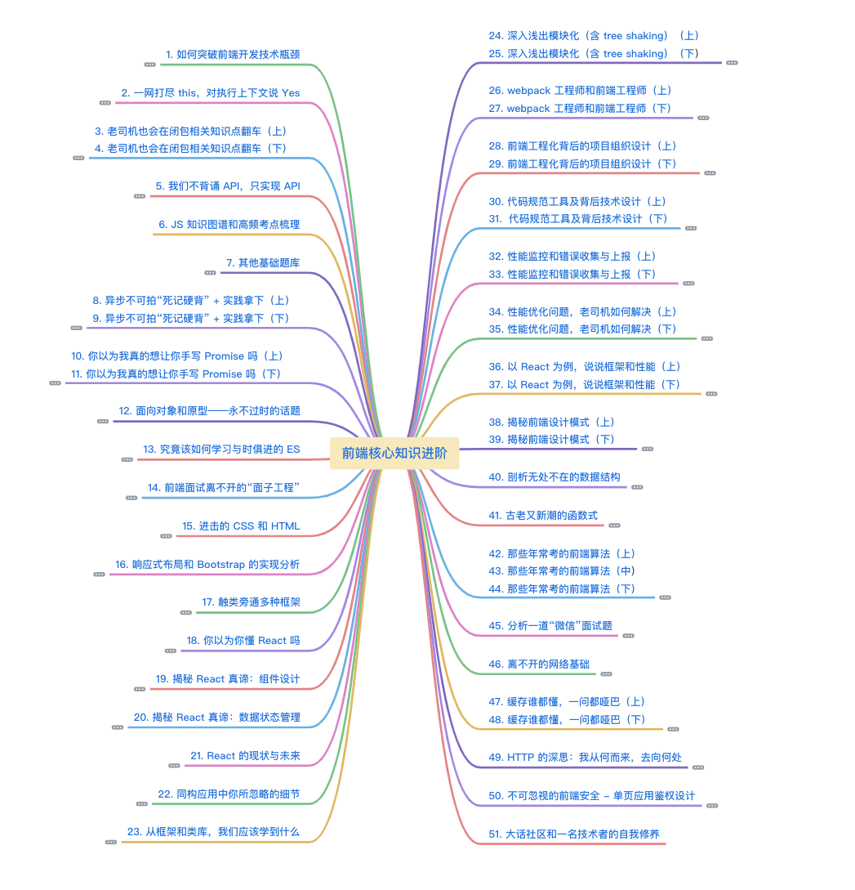
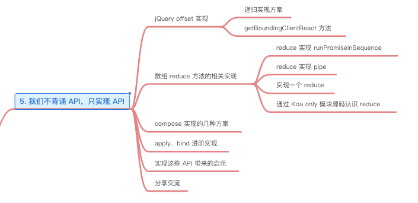
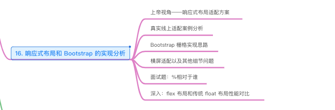
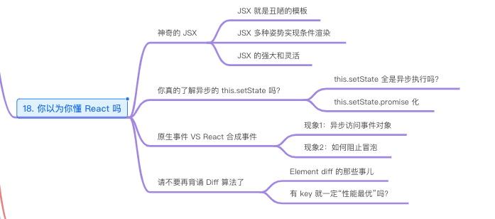
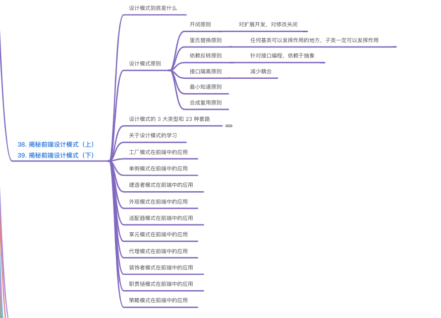

# 前端开发核心知识进阶

作者：侯策

来源平台：gitchat

我的语雀地址：https://www.yuque.com/lionel-6od7c/ngdowg/ehr9u7

资源地址：https://gitbook.cn/gitchat/column/5c91c813968b1d64b1e08fde

图片介绍：

个人评价：本文不是简单的知识罗列，更主要的是提供要自己思考的角度去看待每个知识点。所以虽然这个专栏的叙述有点乱，但我挺喜欢的。

## 目录

### 鸟瞰图

### 前言

### 第一部分 JS 基础强化

### 第二部分 JS 语言进阶

### 第三部分 不可忽视的 HTML 和 CSS

### 第四部分 前端框架

### 第五部分 前端工程化

### 第六部分 性能优化

### 第七部分 编程思维和算法

### 第八部分 网络知识

### 结语

